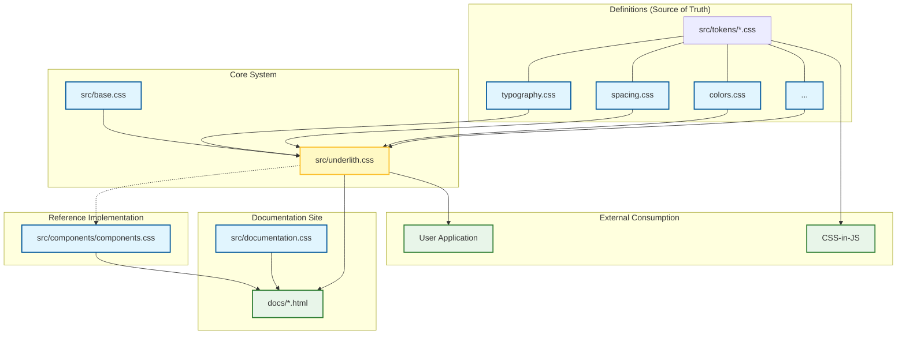

# Underlith Project Architecture

This document provides a comprehensive view of the **Underlith** design tokens system, covering both its conceptual model and concrete file structure.

## 1. Conceptual Model: The Single Source of Truth

Underlith acts as the bridge between design intent and code implementation. It is designed to be **framework-agnostic**, serving as a central repository for design decisions that propagate to various platforms.

```mermaid
graph TD
    %% Layers
    subgraph "Layer 1: Design Definition"
        DesignTools[Design Tools]
        Intent[Design Decisions]
    end

    subgraph "Layer 2: Underlith System"
        direction TB
        Tokens[Atomic Tokens<br/>(Variables)]
        Aliases[Semantic Aliases]
        Base[Base Styles]
        
        Tokens --> Aliases
        Aliases --> Base
    end

    subgraph "Layer 3: Consumption Adapters"
        Vanilla[Direct CSS Import]
        CSSJS[CSS-in-JS]
    end

    subgraph "Layer 4: End Applications"
        WebApp[Web Applications]
        Marketing[Marketing Sites]
        Dashboards[Dashboards/Tools]
    end

    %% Flow
    DesignTools -.->|Specifies| Tokens
    Intent -.->|Guards| Tokens

    %% Internal Flow
    Tokens ---> Vanilla
    Tokens ---> CSSJS

    %% Consumption Flow
    Vanilla --> Marketing
    CSSJS --> Dashboards
    Base --> Marketing
    Base --> WebApp

    %% Styling
    classDef design fill:#e1f5fe,stroke:#01579b;
    classDef system fill:#fff9c4,stroke:#fbc02d,stroke-width:2px;
    classDef adapter fill:#e0f2f1,stroke:#00695c;
    classDef app fill:#f3e5f5,stroke:#7b1fa2;

    class DesignTools,Intent design;
    class Tokens,Aliases,Base system;
    class Vanilla,CSSJS adapter;
    class WebApp,Marketing,Dashboards app;
```

---

## 2. File System Overview

This diagram illustrates the concrete physical structure of the project and how files relate to one another.



## Component Breakdown

### 1. Definitions (Tokens)
Located in `src/tokens/`, these files are the atomic units of the design system. They contain **only** CSS variables (Custom Properties).
*   **`typography.css`** — Font families, sizes, weights.
*   **`spacing.css`** — Spacing scale (margins, paddings).
*   **`colors.css`** — Color palette tokens.
*   **`radius-and-borders.css`**, **`elevation.css`**, **`opacity.css`**, **`breakpoints.css`**.
*   **`motion.css`** — Durations, easings, delays and composite motion tokens (e.g. `--motion-skeleton`, `--motion-fade-up`). Motion automatically respects `prefers-reduced-motion`.

### 2. Core System (Aggregation)
*   **`src/base.css`**: Contains bare-minimum global styles (resets, box-sizing) to ensure tokens render consistently.
*   **`src/underlith.css`**: The main entry point. It imports all token files and the base styles. This is the primary file consumers import to get the "full system".

### 3. Reference Implementation
*   **`src/components/components.css`**: A lightweight, optional layer that demonstrates how tokens can be applied to standard UI elements (buttons, cards, inputs). It explicitly depends on the tokens defined in the Core System but is decoupled from the main `underlith.css` bundle to keep the core lightweight.

### 4. Documentation
The `docs/` folder contains the static HTML site that serves as the manual for Underlith.
*   It consumes **`src/underlith.css`** to display the design system in action.
*   It consumes **`src/components/components.css`** to show component examples.
*   It uses **`docs/css/**`** for site layout and specific styling (grids, headings, code blocks with Prism).
*   Sections are organized with a Table of Contents for quick navigation.

### 5. External Consumption
Underlith is designed to be framework-agnostic:
*   **Plain CSS**: Import `underlith.css`.
*   **CSS-in-JS**: Use the CSS variables directly in styled-components or emotion.

#### Motion guidance
- Use `--duration-*` and `--ease-*` for transitions.
- Prefer composite tokens (e.g. `--motion-skeleton`) for common effects.
- Reduced motion is enforced by collapsing durations under `prefers-reduced-motion: reduce`.
